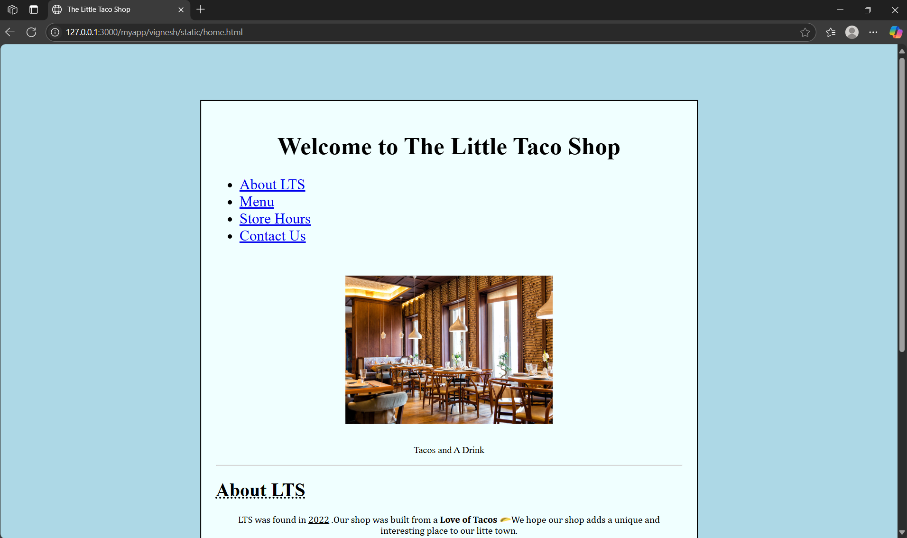
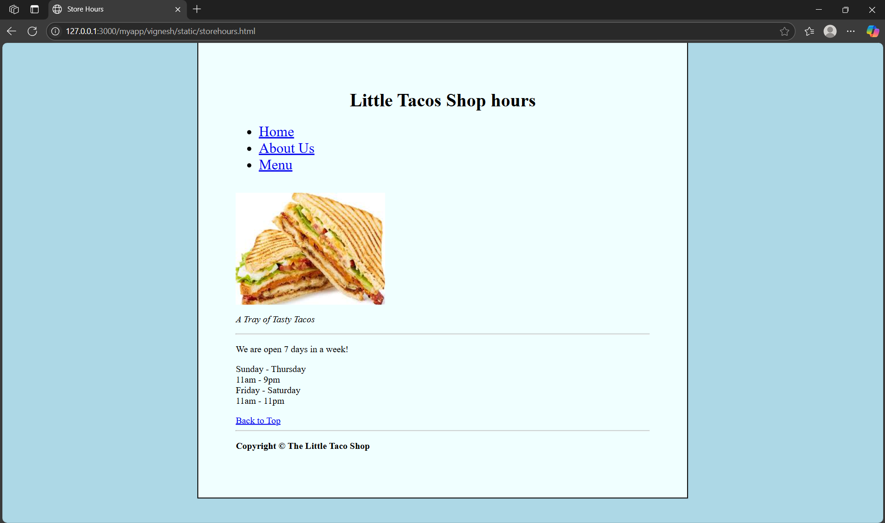

# Ex.07 Restaurant Website
## Date:15/05/25

## AIM:
To develop a static Restaurant website to display the food items and services provided by them.

## DESIGN STEPS:

### Step 1:
Requirement collection.

### Step 2:
Creating the layout using HTML and CSS.

### Step 3:
Updating the sample content.

### Step 4:
Choose the appropriate style and color scheme.

### Step 5:
Validate the layout in various browsers.

### Step 6:
Validate the HTML code.

### Step 7:
Publish the website in the given URL.

## PROGRAM:
### home.html
```html
<!DOCTYPE html>
<html>
    <head>
        <title>The Little Taco Shop</title>
    </head>
    <body style="background-color: lightblue;">
        <div style="border: 2px solid black; padding: 25px; width: 52%; text-align: center; margin: auto; position: absolute; top: 85%; left: 50%; transform: translate(-50%, -50%); background-color: azure;">
            <h1 style="text-align: center; font-size: 41px;" id="loc3" >Welcome to The Little Taco Shop</h1>
            <ul>
                <div style="text-align: left; font-size: 25px;"><li><a href="#loc1">About LTS</a></li></div>
                <div style="text-align: left; font-size: 25px;"><li><a href="#loc2">Menu</a></li></div>
                <div style="text-align: left; font-size: 25px;"><li><a href="storehours.html">Store Hours</a></li></div>
                <div style="text-align: left; font-size: 25px;"><li><a href="contact.html">Contact Us</a></li></div>
            </ul>
            <br>
            <br>
             
            <br>
            <p style="font-family: 'Times New Roman', Times, serif;" style="width: 300px; margin: auto; text-align: center;">Tacos and A Drink</p>
            <hr> 
            <h1 id="loc1" style="text-decoration: underline dotted; text-align: left;">About LTS</h1>
            <P style="font-family: Cambria, Cochin, Georgia, Times, 'Times New Roman', serif;">LTS was found in <u>2022</u> .Our shop was built from a <b>Love of Tacos</b> We hope our shop adds a unique and interesting place to our litte town.</P>
            <h2 style="text-align: left;"><u>Traco Trivia</u></h2>
            <details>
                <summary style="text-align: left;">When did Tacos First Appear In United States</summary>
                <p style="text-align: left;">Jeffrey M. Pilcher, taco historian and professor of history at the University of Minnesota, says the ealier mention of tacos in the United States are in a newspaper from 1905. Source:(<a href="https://www.smithsonianmag.com/"> Smithsonian Magazine)</a>
                </p> 
            </details> 
            <hr>
                <h1 style="text-align: left;" id="loc2">Our Menu</h1>
                <table border="1">
                    <tr><td colspan="3"> OUR TACOS</td></tr>
                    <tr>
                        <th> Tacos </th>
                        <th> Qty </th>
                        <th> Price </th>
                        
                    </tr>
                    <tr> 
                        <td rowspan="3">Crunchy</td>
                        <td>1</td>
                        <td>$1.5</td>
                    </tr>
                    <tr>
                        <td>2</td>
                        <td>$3.0</td>
                    </tr>
                        
                        <td>3</td>
                        <td>$4.5</td>
                    <tr> 
                            <td rowspan="3">Soft</td>
                            <td>1</td>
                            <td>$2.0</td>
                    </tr>
                    <tr>
                            <td>2</td>
                            <td>$4.0</td>
                    </tr>
                            
                            <td>3</td>
                            <td>$6.00</td>
                    <tr><td colspan="3"> Salsa and chips for $25</td></tr>    
                </table>
                <hr>
            <p style="text-align: left;">Copyright &copy; The Little Taco Shop</p>
            <a href="#top">Back To Top</a >   
        </div>
    </body>
</html>
```
### contact.html
```html
<!DOCTYPE html>
<html>
    <head>
        <title>The Little Taco Shop</title>
    </head>
    <body style="background-color: lightblue;">
        <div style="border: 2px solid black; padding: 25px; width: 52%; text-align: center; margin: auto; position: absolute; top: 85%; left: 50%; transform: translate(-50%, -50%); background-color: azure;">
            <h1 style="text-align: center; font-size: 41px;" id="loc3" >Welcome to The Little Taco Shop</h1>
            <ul>
                <div style="text-align: left; font-size: 25px;"><li><a href="#loc1">About LTS</a></li></div>
                <div style="text-align: left; font-size: 25px;"><li><a href="#loc2">Menu</a></li></div>
                <div style="text-align: left; font-size: 25px;"><li><a href="storehours.html">Store Hours</a></li></div>
                <div style="text-align: left; font-size: 25px;"><li><a href="contact.html">Contact Us</a></li></div>
            </ul>
            <br>
            <br>
             
            <br>
            <p style="font-family: 'Times New Roman', Times, serif;" style="width: 300px; margin: auto; text-align: center;">Tacos and A Drink</p>
            <hr> 
            <h1 id="loc1" style="text-decoration: underline dotted; text-align: left;">About LTS</h1>
            <P style="font-family: Cambria, Cochin, Georgia, Times, 'Times New Roman', serif;">LTS was found in <u>2022</u> .Our shop was built from a <b>Love of Tacos</b> We hope our shop adds a unique and interesting place to our litte town.</P>
            <h2 style="text-align: left;"><u>Traco Trivia</u></h2>
            <details>
                <summary style="text-align: left;">When did Tacos First Appear In United States</summary>
                <p style="text-align: left;">Jeffrey M. Pilcher, taco historian and professor of history at the University of Minnesota, says the ealier mention of tacos in the United States are in a newspaper from 1905. Source:(<a href="https://www.smithsonianmag.com/"> Smithsonian Magazine)</a>
                </p> 
            </details> 
            <hr>
                <h1 style="text-align: left;" id="loc2">Our Menu</h1>
                <table border="1">
                    <tr><td colspan="3"> OUR TACOS</td></tr>
                    <tr>
                        <th> Tacos </th>
                        <th> Qty </th>
                        <th> Price </th>
                        
                    </tr>
                    <tr> 
                        <td rowspan="3">Crunchy</td>
                        <td>1</td>
                        <td>$1.5</td>
                    </tr>
                    <tr>
                        <td>2</td>
                        <td>$3.0</td>
                    </tr>
                        
                        <td>3</td>
                        <td>$4.5</td>
                    <tr> 
                            <td rowspan="3">Soft</td>
                            <td>1</td>
                            <td>$2.0</td>
                    </tr>
                    <tr>
                            <td>2</td>
                            <td>$4.0</td>
                    </tr>
                            
                            <td>3</td>
                            <td>$6.00</td>
                    <tr><td colspan="3"> Salsa and chips for $25</td></tr>    
                </table>
                <hr>
            <p style="text-align: left;">Copyright &copy; The Little Taco Shop</p>
            <a href="#top">Back To Top</a >   
        </div>
    </body>
</html>
```
### storehours.html
```html
<html>
    <head>
        <title id="loc4">Store Hours</title>
    </head>
        <body style="background-color: lightblue;">
            <div style="border: 2px solid black; padding: 65px; width:47%; text-align: center; margin: auto; position: absolute; top: 47%; left: 50%; transform: translate(-50%, -50%); background-color: azure;">

            <h1>Little Tacos Shop hours</h1>
            <ul>
                <div style="text-align: left;font-size: 25px;"><li><a href="home.html#loc3">Home</a></li></div>
                <div style="text-align: left;font-size: 25px;"><li><a href="home.html#loc1">About Us</a></li></div>
                <div style="text-align: left;font-size: 25px;"><li><a href="home.html#loc2">Menu</a></li></div>
            </ul>
            <br>
            <div class="image-container" style="text-align: left;">
                
                <p><em>A Tray of Tasty Tacos</em></p>
                <hr>
                <p>We are open 7 days in a week!</p>
                <p>
                  Sunday - Thursday<br>
                  11am - 9pm<br>
                  Friday - Saturday<br>
                  11am - 11pm
                </p>
              </div>
            
            <a href="#top" style="display: block ;text-align: left;">Back to Top</a>
            <hr>
           <b><p style="text-align: left;">Copyright &copy; The Little Taco Shop</p></b>
        </body>
    </div>
    </html>
    </html>
    
</html>
```
## OUTPUT:




## RESULT:
The program for designing software company website using HTML and CSS is completed successfully.
